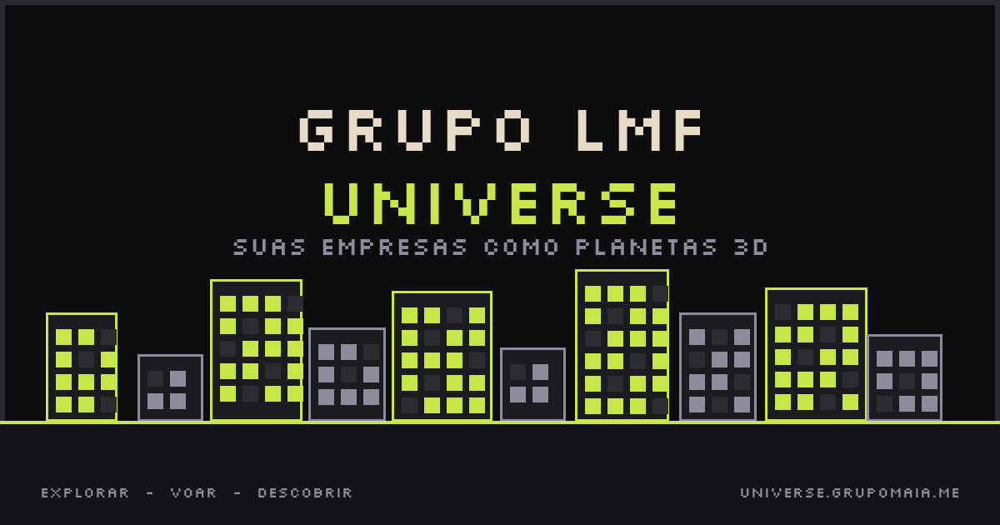

<h1 align="center">Grupo LMF Universe</h1>

<p align="center">
  <strong>Company and GitHub profiles as interactive 3D planets.</strong>
</p>

<p align="center">
  <a href="https://universe.grupomaia.me">universe.grupomaia.me</a>
</p>

<p align="center">
  
</p>

---

## What is Grupo LMF Universe?

Grupo LMF Universe turns company and GitHub profiles into a living 3D universe. Each planet represents identity, traction, activity, health, and community presence. Visitors can explore planets, open profile panels, compare signals, customize identity, and place native ads inside the world.

## Product pillars

- **Universe exploration** — browse highlighted planets, search companies, and understand visual signals through an in-app legend.
- **Planet profiles** — each profile has metrics, activity, achievements, sharing, and contextual actions.
- **Planet Studio** — customize identity with colors, auras, billboards, effects, crowns, and vehicles.
- **Native advertising** — planes, blimps, billboards, and planet-side placements that live inside the visual world.
- **Engagement systems** — achievements, dailies, streaks, kudos, referrals, raids, and live presence.
- **VS Code presence** — optional extension support for live coding activity without collecting source code.

## How planets work

| Signal | Visual effect | Meaning |
| --- | --- | --- |
| Traction | Planet size and prominence | Composite of activity, stars, revenue, and profile strength |
| Brand/sector | Color and texture | Custom identity or inferred category |
| Health | Stability marks | Lower health creates visible stress/damage |
| Activity | Freshness and live presence | Recent sync and real-time signals |

The core UX is intentionally simple: search or click a planet, read its context, then act — open profile, customize, compare, share, or advertise.

## Tech stack

- **Framework:** [Next.js](https://nextjs.org) 16, App Router, Turbopack
- **3D/visuals:** [Three.js](https://threejs.org), [@react-three/fiber](https://github.com/pmndrs/react-three-fiber), [drei](https://github.com/pmndrs/drei), Cobe
- **Database & Auth:** [Supabase](https://supabase.com), PostgreSQL, Auth, Row Level Security
- **Payments:** Stripe, NOWPayments, AbacatePay
- **Email:** Resend
- **Styling:** Tailwind CSS v4 with pixel/space visual language
- **Hosting:** Vercel

## Getting started

```bash
npm install
cp .env.example .env.local
npm run dev
```

Open [http://localhost:3001](http://localhost:3001).

## Quality gates

```bash
npm run typecheck
npm run lint:ci
npm run build
```

## License

[AGPL-3.0](LICENSE) — public deployments must share the corresponding source code.

---

<p align="center">
  Built by <a href="https://x.com/leonardomaia253">@leonardomaia253</a>
</p>
